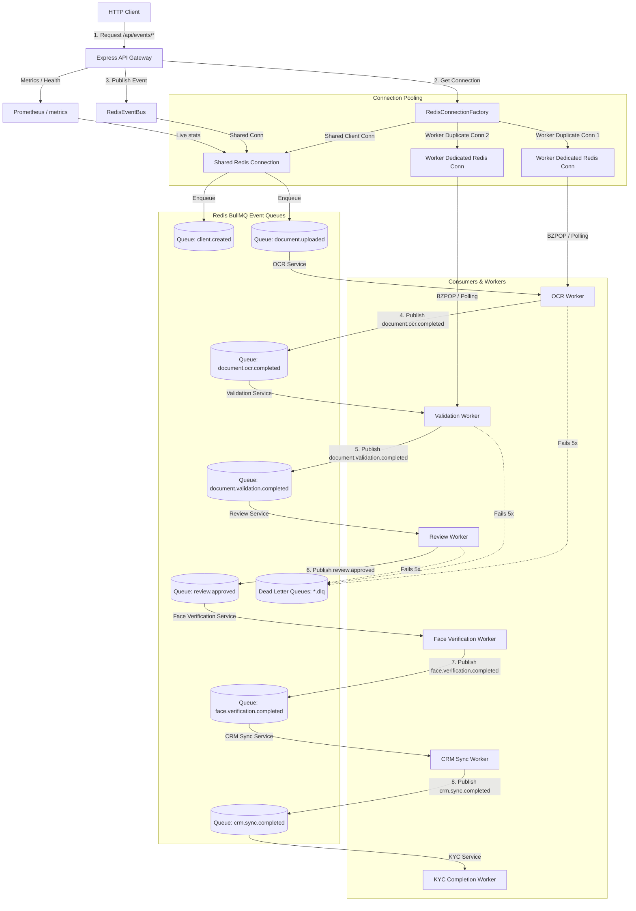

# System Architecture Diagram

This document illustrates the event-driven architecture and processing flow within the API Gateway & Event System, highlighting the shared connection pools, dedicated worker connections, and queue structures.

## System Topology & Flow Diagram

## Architectural Highlights

1. **Connection Hardening:** 
   - Non-blocking components (Express Route Handlers, publishers, registries, database updates) share a single primary Redis connection.
   - CPU-blocking and polling components (BullMQ `Worker` threads) duplicate the Redis connection dynamically to guarantee isolated network buffers.
2. **Event Pipeline Chaining:**
   - Event processing is completely decoupled. One consumer finishes processing, saves state to the database, and publishes the next event in the chain to trigger the next worker.
3. **Observability Integration:**
   - The main `/metrics` endpoint dynamically queries the queues for live statistics, updating gauge metrics to show active worker load, backlog queue depth, and dead letters.
