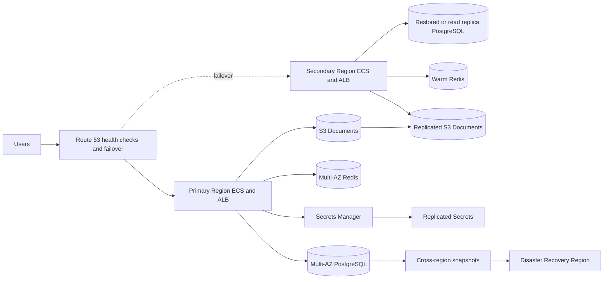

# Multi-Region Architecture

## Regions

- Primary region: active production traffic
- Secondary region: warm standby with replicated storage and deployable ECS services
- Disaster recovery region: backup restore target and incident validation region

## Replication

- RDS: automated backups, manual snapshots copied cross-region, optional read replica for tighter RPO
- S3: versioned bucket with cross-region replication
- Secrets Manager: replicated secrets per region with KMS keys
- Container images: ECR replication or CI push to each regional registry
- DNS: Route 53 health checks with failover records

## Recovery Procedure

1. Declare incident and freeze nonessential deployments.
2. Verify primary ALB, ECS, RDS, Redis, and S3 health.
3. Promote secondary database replica or restore latest copied snapshot.
4. Update regional Secrets Manager values for `DATABASE_URL` and `REDIS_URL`.
5. Scale secondary ECS services to production desired counts.
6. Run Prisma migration status and gateway `/health`.
7. Shift Route 53 failover to secondary.
8. Validate auth, document upload, worker processing, metrics, and audit logging.

## Runbooks

- Backup validation: `scripts/validate-dr.sh` or `scripts/validate-dr.ps1`
- Database restore: `scripts/restore-db.sh` or `scripts/restore-db.ps1`
- ECS deployment: `scripts/deploy-prod.sh` or `scripts/deploy-prod.ps1`
